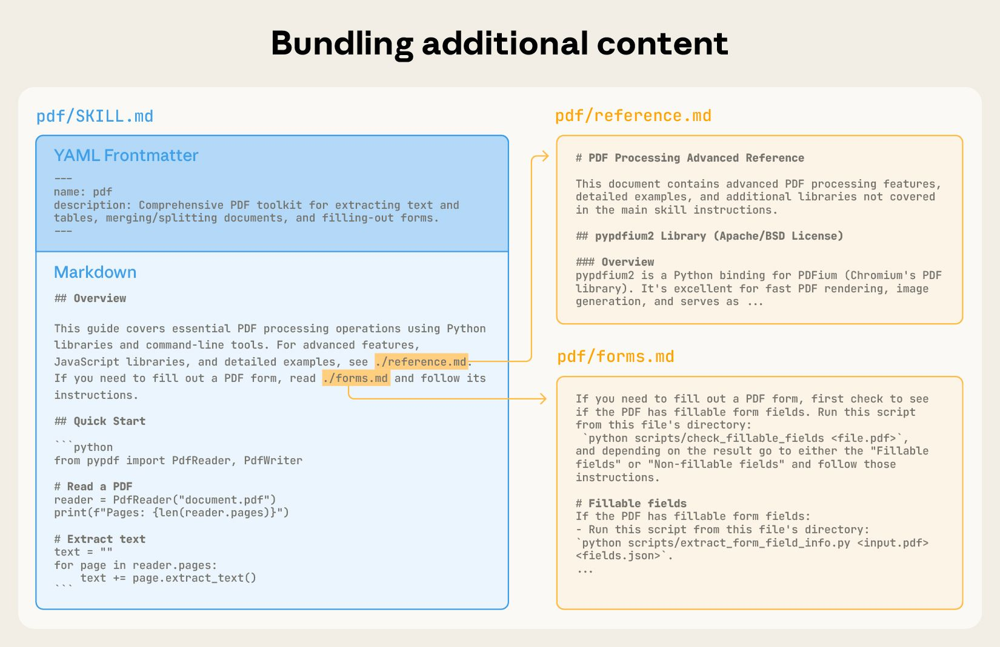
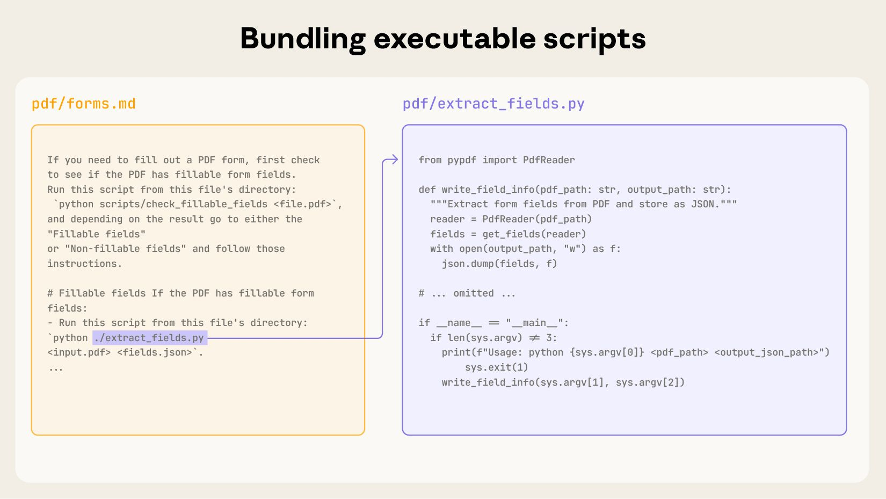

# Skill authoring best practices

Learn how to write effective Skills that agents can discover and use successfully.

---

Good Skills are concise, well-structured, and tested with real usage. This guide provides practical authoring decisions to help you write Skills that agents can discover and use effectively.

For conceptual background on how Skills work, see the [Skills overview](/docs/en/agents-and-tools/agent-skills/overview).

## Core principles

### Concise is key

The context window is a public good. Your Skill shares the context window with everything else the agent needs to know, including:
- The system prompt
- Conversation history
- Other Skills' metadata
- Your actual request

Not every token in your Skill has an immediate cost. At startup, only the metadata (name and description) from all Skills is pre-loaded. The agent reads SKILL.md only when the Skill becomes relevant, and reads additional files only as needed. However, being concise in SKILL.md still matters: once the agent loads it, every token competes with conversation history and other context.

**Default assumption**: The agent is already very smart

Only add context the agent doesn't already have. Challenge each piece of information:
- "Does the agent really need this explanation?"
- "Can I assume the agent knows this?"
- "Does this paragraph justify its token cost?"

**Good example: Concise** (approximately 50 tokens):
````markdown
## Extract PDF text

Use pdfplumber for text extraction:

```python
import pdfplumber

with pdfplumber.open("file.pdf") as pdf:
    text = pdf.pages[0].extract_text()
```
````

**Bad example: Too verbose** (approximately 150 tokens):
```markdown
## Extract PDF text

PDF (Portable Document Format) files are a common file format that contains
text, images, and other content. To extract text from a PDF, you'll need to
use a library. There are many libraries available for PDF processing, but we
recommend pdfplumber because it's easy to use and handles most cases well.
First, you'll need to install it using pip. Then you can use the code below...
```

The concise version assumes the agent knows what PDFs are and how libraries work.

### Set appropriate degrees of freedom

Match the level of specificity to the task's fragility and variability.

**High freedom** (text-based instructions):

Use when:
- Multiple approaches are valid
- Decisions depend on context
- Heuristics guide the approach

Example:
```markdown
## Code review process

1. Analyze the code structure and organization
2. Check for potential bugs or edge cases
3. Suggest improvements for readability and maintainability
4. Verify adherence to project conventions
```

**Medium freedom** (pseudocode or scripts with parameters):

Use when:
- A preferred pattern exists
- Some variation is acceptable
- Configuration affects behavior

Example:
````markdown
## Generate report

Use this template and customize as needed:

```python
def generate_report(data, format="markdown", include_charts=True):
    # Process data
    # Generate output in specified format
    # Optionally include visualizations
```
````

**Low freedom** (specific scripts, few or no parameters):

Use when:
- Operations are fragile and error-prone
- Consistency is critical
- A specific sequence must be followed

Example:
````markdown
## Database migration

Run exactly this script:

```bash
python scripts/migrate.py --verify --backup
```

Do not modify the command or add additional flags.
````

**Analogy**: Think of Claude as a robot exploring a path:
- **Narrow bridge with cliffs on both sides**: There's only one safe way forward. Provide specific guardrails and exact instructions (low freedom). Example: database migrations that must run in exact sequence.
- **Open field with no hazards**: Many paths lead to success. Give general direction and trust the agent to find the best route (high freedom). Example: code reviews where context determines the best approach.

### Test with all models you plan to use

Skills act as additions to models, so effectiveness depends on the underlying model. Test your Skill with all the models you plan to use it with.

**Testing considerations by model capability**:
- **Fast/economical models**: Does the Skill provide enough guidance?
- **Balanced models**: Is the Skill clear and efficient?
- **Powerful reasoning models**: Does the Skill avoid over-explaining?

What works perfectly for powerful models might need more detail for smaller ones. If you plan to use your Skill across multiple models, aim for instructions that work well with all of them.

## Skill structure

<Note>
**YAML Frontmatter**: The SKILL.md frontmatter requires two fields:

`name`:
- Maximum 64 characters
- Must contain only lowercase letters, numbers, and hyphens
- Cannot contain XML tags
- Cannot contain reserved words

`description`:
- Must be non-empty
- Maximum 1024 characters
- Cannot contain XML tags
- Should describe what the Skill does and when to use it

For complete Skill structure details, see the [Skills spec](agent-skills-spec.md).
</Note>

### Naming conventions

Use consistent naming patterns to make Skills easier to reference and discuss. We recommend using **gerund form** (verb + -ing) for Skill names, as this clearly describes the activity or capability the Skill provides.

Remember that the `name` field must use lowercase letters, numbers, and hyphens only.

**Good naming examples (gerund form)**:
- `processing-pdfs`
- `analyzing-spreadsheets`
- `managing-databases`
- `testing-code`
- `writing-documentation`

**Acceptable alternatives**:
- Noun phrases: `pdf-processing`, `spreadsheet-analysis`
- Action-oriented: `process-pdfs`, `analyze-spreadsheets`

**Avoid**:
- Vague names: `helper`, `utils`, `tools`
- Overly generic: `documents`, `data`, `files`
- Reserved words in name
- Inconsistent patterns within your skill collection

Consistent naming makes it easier to:
- Reference Skills in documentation and conversations
- Understand what a Skill does at a glance
- Organize and search through multiple Skills
- Maintain a professional, cohesive skill library

### Writing effective descriptions

The `description` field enables Skill discovery and should include both what the Skill does and when to use it.

**Always write in third person**. The description is injected into the system prompt, and inconsistent point-of-view can cause discovery problems.

- **Good:** "Processes Excel files and generates reports"
- **Avoid:** "I can help you process Excel files"
- **Avoid:** "You can use this to process Excel files"

**Be specific and include key terms**. Include both what the Skill does and specific triggers/contexts for when to use it.

Each Skill has exactly one description field. The description is critical for skill selection: the agent uses it to choose the right Skill from potentially 100+ available Skills. Your description must provide enough detail for the agent to know when to select this Skill, while the rest of SKILL.md provides the implementation details.

Effective examples:

**PDF Processing skill:**
```yaml
description: Extract text and tables from PDF files, fill forms, merge documents. Use when working with PDF files or when the user mentions PDFs, forms, or document extraction.
```

**Excel Analysis skill:**
```yaml
description: Analyze Excel spreadsheets, create pivot tables, generate charts. Use when analyzing Excel files, spreadsheets, tabular data, or .xlsx files.
```

**Git Commit Helper skill:**
```yaml
description: Generate descriptive commit messages by analyzing git diffs. Use when the user asks for help writing commit messages or reviewing staged changes.
```

Avoid vague descriptions like these:

```yaml
description: Helps with documents
```
```yaml
description: Processes data
```
```yaml
description: Does stuff with files
```

### Progressive disclosure patterns

SKILL.md serves as an overview that points the agent to detailed materials as needed, like a table of contents in an onboarding guide.

**Practical guidance:**
- Keep SKILL.md body under 500 lines for optimal performance
- Split content into separate files when approaching this limit
- Use the patterns below to organize instructions, code, and resources effectively

#### Visual overview: From simple to complex

A basic Skill starts with just a SKILL.md file containing metadata and instructions:


As your Skill grows, you can bundle additional content that Claude loads only when needed:



The complete Skill directory structure might look like this:

```
pdf/
├── SKILL.md              # Main instructions (loaded when triggered)
├── FORMS.md              # Form-filling guide (loaded as needed)
├── reference.md          # API reference (loaded as needed)
├── examples.md           # Usage examples (loaded as needed)
└── scripts/
    ├── analyze_form.py   # Utility script (executed, not loaded)
    ├── fill_form.py      # Form filling script
    └── validate.py       # Validation script
```

#### Pattern 1: High-level guide with references

````markdown
---
name: pdf-processing
description: Extracts text and tables from PDF files, fills forms, and merges documents. Use when working with PDF files or when the user mentions PDFs, forms, or document extraction.
---

# PDF Processing

## Quick start

Extract text with pdfplumber:
```python
import pdfplumber
with pdfplumber.open("file.pdf") as pdf:
    text = pdf.pages[0].extract_text()
```

## Advanced features

**Form filling**: See [FORMS.md](FORMS.md) for complete guide
**API reference**: See [REFERENCE.md](REFERENCE.md) for all methods
**Examples**: See [EXAMPLES.md](EXAMPLES.md) for common patterns
````

The agent loads FORMS.md, REFERENCE.md, or EXAMPLES.md only when needed.

#### Pattern 2: Domain-specific organization

For Skills with multiple domains, organize content by domain to avoid loading irrelevant context. When a user asks about sales metrics, the agent only needs to read sales-related schemas, not finance or marketing data. This keeps token usage low and context focused.

```
bigquery-skill/
├── SKILL.md (overview and navigation)
└── reference/
    ├── finance.md (revenue, billing metrics)
    ├── sales.md (opportunities, pipeline)
    ├── product.md (API usage, features)
    └── marketing.md (campaigns, attribution)
```

````markdown SKILL.md
# BigQuery Data Analysis

## Available datasets

**Finance**: Revenue, ARR, billing -> See [reference/finance.md](reference/finance.md)
**Sales**: Opportunities, pipeline, accounts -> See [reference/sales.md](reference/sales.md)
**Product**: API usage, features, adoption -> See [reference/product.md](reference/product.md)
**Marketing**: Campaigns, attribution, email -> See [reference/marketing.md](reference/marketing.md)

## Quick search

Find specific metrics using grep:

```bash
grep -i "revenue" reference/finance.md
grep -i "pipeline" reference/sales.md
grep -i "api usage" reference/product.md
```
````

#### Pattern 3: Conditional details

Show basic content, link to advanced content:

```markdown
# DOCX Processing

## Creating documents

Use docx-js for new documents. See [DOCX-JS.md](DOCX-JS.md).

## Editing documents

For simple edits, modify the XML directly.

**For tracked changes**: See [REDLINING.md](REDLINING.md)
**For OOXML details**: See [OOXML.md](OOXML.md)
```

The agent reads REDLINING.md or OOXML.md only when the user needs those features.

### Avoid deeply nested references

Agents may partially read files when they're referenced from other referenced files. When encountering nested references, the agent might use commands like `head -100` to preview content rather than reading entire files, resulting in incomplete information.

**Keep references one level deep from SKILL.md**. All reference files should link directly from SKILL.md to ensure the agent reads complete files when needed.

**Bad example: Too deep**:
```markdown
# SKILL.md
See [advanced.md](advanced.md)...

# advanced.md
See [details.md](details.md)...

# details.md
Here's the actual information...
```

**Good example: One level deep**:
```markdown
# SKILL.md

**Basic usage**: [instructions in SKILL.md]
**Advanced features**: See [advanced.md](advanced.md)
**API reference**: See [reference.md](reference.md)
**Examples**: See [examples.md](examples.md)
```

### Structure longer reference files with table of contents

For reference files longer than 100 lines, include a table of contents at the top. This ensures the agent can see the full scope of available information even when previewing with partial reads.

**Example**:
```markdown
# API Reference

## Contents
- Authentication and setup
- Core methods (create, read, update, delete)
- Advanced features (batch operations, webhooks)
- Error handling patterns
- Code examples

## Authentication and setup
...

## Core methods
...
```

The agent can then read the complete file or jump to specific sections as needed.

## Workflows and feedback loops

### Use workflows for complex tasks

Break complex operations into clear, sequential steps. For particularly complex workflows, provide a checklist that the agent can copy into its response and check off as it progresses.

**Example 1: Research synthesis workflow** (for Skills without code):

````markdown
## Research synthesis workflow

Copy this checklist and track your progress:

```
Research Progress:
- [ ] Step 1: Read all source documents
- [ ] Step 2: Identify key themes
- [ ] Step 3: Cross-reference claims
- [ ] Step 4: Create structured summary
- [ ] Step 5: Verify citations
```

**Step 1: Read all source documents**

Review each document in the `sources/` directory. Note the main arguments and supporting evidence.

**Step 2: Identify key themes**

Look for patterns across sources. What themes appear repeatedly? Where do sources agree or disagree?

**Step 3: Cross-reference claims**

For each major claim, verify it appears in the source material. Note which source supports each point.

**Step 4: Create structured summary**

Organize findings by theme. Include:
- Main claim
- Supporting evidence from sources
- Conflicting viewpoints (if any)

**Step 5: Verify citations**

Check that every claim references the correct source document. If citations are incomplete, return to Step 3.
````

This example shows how workflows apply to analysis tasks that don't require code. The checklist pattern works for any complex, multi-step process.

**Example 2: PDF form filling workflow** (for Skills with code):

````markdown
## PDF form filling workflow

Copy this checklist and check off items as you complete them:

```
Task Progress:
- [ ] Step 1: Analyze the form (run analyze_form.py)
- [ ] Step 2: Create field mapping (edit fields.json)
- [ ] Step 3: Validate mapping (run validate_fields.py)
- [ ] Step 4: Fill the form (run fill_form.py)
- [ ] Step 5: Verify output (run verify_output.py)
```

**Step 1: Analyze the form**

Run: `python scripts/analyze_form.py input.pdf`

This extracts form fields and their locations, saving to `fields.json`.

**Step 2: Create field mapping**

Edit `fields.json` to add values for each field.

**Step 3: Validate mapping**

Run: `python scripts/validate_fields.py fields.json`

Fix any validation errors before continuing.

**Step 4: Fill the form**

Run: `python scripts/fill_form.py input.pdf fields.json output.pdf`

**Step 5: Verify output**

Run: `python scripts/verify_output.py output.pdf`

If verification fails, return to Step 2.
````

Clear steps prevent the agent from skipping critical validation. The checklist helps both the agent and you track progress through multi-step workflows.

### Implement feedback loops

**Common pattern**: Run validator -> fix errors -> repeat

This pattern greatly improves output quality.

**Example 1: Style guide compliance** (for Skills without code):

```markdown
## Content review process

1. Draft your content following the guidelines in STYLE_GUIDE.md
2. Review against the checklist:
   - Check terminology consistency
   - Verify examples follow the standard format
   - Confirm all required sections are present
3. If issues found:
   - Note each issue with specific section reference
   - Revise the content
   - Review the checklist again
4. Only proceed when all requirements are met
5. Finalize and save the document
```

This shows the validation loop pattern using reference documents instead of scripts. The "validator" is STYLE_GUIDE.md, and the agent performs the check by reading and comparing.

**Example 2: Document editing process** (for Skills with code):

```markdown
## Document editing process

1. Make your edits to `word/document.xml`
2. **Validate immediately**: `python ooxml/scripts/validate.py unpacked_dir/`
3. If validation fails:
   - Review the error message carefully
   - Fix the issues in the XML
   - Run validation again
4. **Only proceed when validation passes**
5. Rebuild: `python ooxml/scripts/pack.py unpacked_dir/ output.docx`
6. Test the output document
```

The validation loop catches errors early.

## Content guidelines

### Avoid time-sensitive information

Don't include information that will become outdated:

**Bad example: Time-sensitive** (will become wrong):
```markdown
If you're doing this before August 2025, use the old API.
After August 2025, use the new API.
```

**Good example** (use "old patterns" section):
```markdown
## Current method

Use the v2 API endpoint: `api.example.com/v2/messages`

## Old patterns

<details>
<summary>Legacy v1 API (deprecated 2025-08)</summary>

The v1 API used: `api.example.com/v1/messages`

This endpoint is no longer supported.
</details>
```

The old patterns section provides historical context without cluttering the main content.

### Use consistent terminology

Choose one term and use it throughout the Skill:

**Good - Consistent**:
- Always "API endpoint"
- Always "field"
- Always "extract"

**Bad - Inconsistent**:
- Mix "API endpoint", "URL", "API route", "path"
- Mix "field", "box", "element", "control"
- Mix "extract", "pull", "get", "retrieve"

Consistency helps the agent understand and follow instructions.

## Common patterns

### Template pattern

Provide templates for output format. Match the level of strictness to your needs.

**For strict requirements** (like API responses or data formats):

````markdown
## Report structure

ALWAYS use this exact template structure:

```markdown
# [Analysis Title]

## Executive summary
[One-paragraph overview of key findings]

## Key findings
- Finding 1 with supporting data
- Finding 2 with supporting data
- Finding 3 with supporting data

## Recommendations
1. Specific actionable recommendation
2. Specific actionable recommendation
```
````

**For flexible guidance** (when adaptation is useful):

````markdown
## Report structure

Here is a sensible default format, but use your best judgment based on the analysis:

```markdown
# [Analysis Title]

## Executive summary
[Overview]

## Key findings
[Adapt sections based on what you discover]

## Recommendations
[Tailor to the specific context]
```

Adjust sections as needed for the specific analysis type.
````

### Examples pattern

For Skills where output quality depends on seeing examples, provide input/output pairs just like in regular prompting:

````markdown
## Commit message format

Generate commit messages following these examples:

**Example 1:**
Input: Added user authentication with JWT tokens
Output:
```
feat(auth): implement JWT-based authentication

Add login endpoint and token validation middleware
```

**Example 2:**
Input: Fixed bug where dates displayed incorrectly in reports
Output:
```
fix(reports): correct date formatting in timezone conversion

Use UTC timestamps consistently across report generation
```

**Example 3:**
Input: Updated dependencies and refactored error handling
Output:
```
chore: update dependencies and refactor error handling

- Upgrade lodash to 4.17.21
- Standardize error response format across endpoints
```

Follow this style: type(scope): brief description, then detailed explanation.
````

Examples help Claude understand the desired style and level of detail more clearly than descriptions alone.

### Conditional workflow pattern

Guide Claude through decision points:

```markdown
## Document modification workflow

1. Determine the modification type:

   **Creating new content?** -> Follow "Creation workflow" below
   **Editing existing content?** -> Follow "Editing workflow" below

2. Creation workflow:
   - Use docx-js library
   - Build document from scratch
   - Export to .docx format

3. Editing workflow:
   - Unpack existing document
   - Modify XML directly
   - Validate after each change
   - Repack when complete
```

If workflows become large or complicated with many steps, consider pushing them into separate files and tell the agent to read the appropriate file based on the task at hand.

## Evaluation and iteration

### Build evaluations first

**Create evaluations BEFORE writing extensive documentation.** This ensures your Skill solves real problems rather than documenting imagined ones.

**Evaluation-driven development:**
1. **Identify gaps**: Run the agent on representative tasks without a Skill. Document specific failures or missing context
2. **Create evaluations**: Build three scenarios that test these gaps
3. **Establish baseline**: Measure the agent's performance without the Skill
4. **Write minimal instructions**: Create just enough content to address the gaps and pass evaluations
5. **Iterate**: Execute evaluations, compare against baseline, and refine

This approach ensures you're solving actual problems rather than anticipating requirements that may never materialize.

**Evaluation structure**:
```json
{
  "skills": ["pdf-processing"],
  "query": "Extract all text from this PDF file and save it to output.txt",
  "files": ["test-files/document.pdf"],
  "expected_behavior": [
    "Successfully reads the PDF file using an appropriate PDF processing library or command-line tool",
    "Extracts text content from all pages in the document without missing any pages",
    "Saves the extracted text to a file named output.txt in a clear, readable format"
  ]
}
```

This example demonstrates a data-driven evaluation with a simple testing rubric. Evaluations are your source of truth for measuring Skill effectiveness.

### Develop Skills iteratively with the agent

The most effective Skill development process involves the agent itself. Work with one instance ("Agent A") to create a Skill that will be used by other instances ("Agent B"). Agent A helps you design and refine instructions, while Agent B tests them in real tasks. This works because LLMs understand both how to write effective agent instructions and what information agents need.

**Creating a new Skill:**

1. **Complete a task without a Skill**: Work through a problem with Agent A using normal prompting. As you work, you'll naturally provide context, explain preferences, and share procedural knowledge. Notice what information you repeatedly provide.

2. **Identify the reusable pattern**: After completing the task, identify what context you provided that would be useful for similar future tasks.

   **Example**: If you worked through a BigQuery analysis, you might have provided table names, field definitions, filtering rules (like "always exclude test accounts"), and common query patterns.

3. **Ask Agent A to create a Skill**: "Create a Skill that captures this BigQuery analysis pattern we just used. Include the table schemas, naming conventions, and the rule about filtering test accounts."

   LLMs understand the Skill format and structure natively. You don't need special system prompts or a "writing skills" skill to get the agent to help create Skills. Simply ask the agent to create a Skill and it will generate properly structured SKILL.md content with appropriate frontmatter and body content.

4. **Review for conciseness**: Check that Agent A hasn't added unnecessary explanations. Ask: "Remove the explanation about what win rate means - the agent already knows that."

5. **Improve information architecture**: Ask Agent A to organize the content more effectively. For example: "Organize this so the table schema is in a separate reference file. We might add more tables later."

6. **Test on similar tasks**: Use the Skill with Agent B (a fresh instance with the Skill loaded) on related use cases. Observe whether Agent B finds the right information, applies rules correctly, and handles the task successfully.

7. **Iterate based on observation**: If Agent B struggles or misses something, return to Agent A with specifics: "When the agent used this Skill, it forgot to filter by date for Q4. Should we add a section about date filtering patterns?"

**Iterating on existing Skills:**

The same hierarchical pattern continues when improving Skills. You alternate between:
- **Working with Agent A** (the expert who helps refine the Skill)
- **Testing with Agent B** (the agent using the Skill to perform real work)
- **Observing Agent B's behavior** and bringing insights back to Agent A

1. **Use the Skill in real workflows**: Give Agent B (with the Skill loaded) actual tasks, not test scenarios

2. **Observe Agent B's behavior**: Note where it struggles, succeeds, or makes unexpected choices

   **Example observation**: "When I asked Agent B for a regional sales report, it wrote the query but forgot to filter out test accounts, even though the Skill mentions this rule."

3. **Return to Agent A for improvements**: Share the current SKILL.md and describe what you observed. Ask: "I noticed Agent B forgot to filter test accounts when I asked for a regional report. The Skill mentions filtering, but maybe it's not prominent enough?"

4. **Review Agent A's suggestions**: Agent A might suggest reorganizing to make rules more prominent, using stronger language like "MUST filter" instead of "always filter", or restructuring the workflow section.

5. **Apply and test changes**: Update the Skill with Agent A's refinements, then test again with Agent B on similar requests

6. **Repeat based on usage**: Continue this observe-refine-test cycle as you encounter new scenarios. Each iteration improves the Skill based on real agent behavior, not assumptions.

**Gathering team feedback:**

1. Share Skills with teammates and observe their usage
2. Ask: Does the Skill activate when expected? Are instructions clear? What's missing?
3. Incorporate feedback to address blind spots in your own usage patterns

**Why this approach works**: Agent A understands agent needs, you provide domain expertise, Agent B reveals gaps through real usage, and iterative refinement improves Skills based on observed behavior rather than assumptions.

### Observe how the agent navigates Skills

As you iterate on Skills, pay attention to how the agent actually uses them in practice. Watch for:

- **Unexpected exploration paths**: Does the agent read files in an order you didn't anticipate? This might indicate your structure isn't as intuitive as you thought
- **Missed connections**: Does the agent fail to follow references to important files? Your links might need to be more explicit or prominent
- **Overreliance on certain sections**: If the agent repeatedly reads the same file, consider whether that content should be in the main SKILL.md instead
- **Ignored content**: If the agent never accesses a bundled file, it might be unnecessary or poorly signaled in the main instructions

Iterate based on these observations rather than assumptions. The 'name' and 'description' in your Skill's metadata are particularly critical. The agent uses these when deciding whether to trigger the Skill in response to the current task. Make sure they clearly describe what the Skill does and when it should be used.

## Anti-patterns to avoid

### Avoid Windows-style paths

Always use forward slashes in file paths, even on Windows:

- ✓ **Good**: `scripts/helper.py`, `reference/guide.md`
- ✗ **Avoid**: `scripts\helper.py`, `reference\guide.md`

Unix-style paths work across all platforms, while Windows-style paths cause errors on Unix systems.

### Avoid offering too many options

Don't present multiple approaches unless necessary:

````markdown
**Bad example: Too many choices** (confusing):
"You can use pypdf, or pdfplumber, or PyMuPDF, or pdf2image, or..."

**Good example: Provide a default** (with escape hatch):
"Use pdfplumber for text extraction:
```python
import pdfplumber
```

For scanned PDFs requiring OCR, use pdf2image with pytesseract instead."
````

## Advanced: Skills with executable code

The sections below focus on Skills that include executable scripts. If your Skill uses only markdown instructions, skip to [Checklist for effective Skills](#checklist-for-effective-skills).

### Solve, don't punt

When writing scripts for Skills, handle error conditions rather than punting to the agent.

**Good example: Handle errors explicitly**:
```python
def process_file(path):
    """Process a file, creating it if it doesn't exist."""
    try:
        with open(path) as f:
            return f.read()
    except FileNotFoundError:
        # Create file with default content instead of failing
        print(f"File {path} not found, creating default")
        with open(path, 'w') as f:
            f.write('')
        return ''
    except PermissionError:
        # Provide alternative instead of failing
        print(f"Cannot access {path}, using default")
        return ''
```

**Bad example: Punt to agent**:
```python
def process_file(path):
    # Just fail and let the agent figure it out
    return open(path).read()
```

Configuration parameters should also be justified and documented to avoid "voodoo constants" (Ousterhout's law). If you don't know the right value, how will the agent determine it?

**Good example: Self-documenting**:
```python
# HTTP requests typically complete within 30 seconds
# Longer timeout accounts for slow connections
REQUEST_TIMEOUT = 30

# Three retries balances reliability vs speed
# Most intermittent failures resolve by the second retry
MAX_RETRIES = 3
```

**Bad example: Magic numbers**:
```python
TIMEOUT = 47  # Why 47?
RETRIES = 5   # Why 5?
```

### Provide utility scripts

Even if the agent could write a script, pre-made scripts offer advantages:

**Benefits of utility scripts**:
- More reliable than generated code
- Save tokens (no need to include code in context)
- Save time (no code generation required)
- Ensure consistency across uses



The diagram above shows how executable scripts work alongside instruction files. The instruction file (forms.md) references the script, and the agent can execute it without loading its contents into context.

**Important distinction**: Make clear in your instructions whether the agent should:
- **Execute the script** (most common): "Run `analyze_form.py` to extract fields"
- **Read it as reference** (for complex logic): "See `analyze_form.py` for the field extraction algorithm"

For most utility scripts, execution is preferred because it's more reliable and efficient.

**Example**:
````markdown
## Utility scripts

**analyze_form.py**: Extract all form fields from PDF

```bash
python scripts/analyze_form.py input.pdf > fields.json
```

Output format:
```json
{
  "field_name": {"type": "text", "x": 100, "y": 200},
  "signature": {"type": "sig", "x": 150, "y": 500}
}
```

**validate_boxes.py**: Check for overlapping bounding boxes

```bash
python scripts/validate_boxes.py fields.json
# Returns: "OK" or lists conflicts
```

**fill_form.py**: Apply field values to PDF

```bash
python scripts/fill_form.py input.pdf fields.json output.pdf
```
````

### Use visual analysis

When inputs can be rendered as images, have Claude analyze them:

````markdown
## Form layout analysis

1. Convert PDF to images:
   ```bash
   python scripts/pdf_to_images.py form.pdf
   ```

2. Analyze each page image to identify form fields
3. Claude can see field locations and types visually
````

<Note>
In this example, you'd need to write the `pdf_to_images.py` script.
</Note>

Claude's vision capabilities help understand layouts and structures.

### Create verifiable intermediate outputs

When Claude performs complex, open-ended tasks, it can make mistakes. The "plan-validate-execute" pattern catches errors early by having Claude first create a plan in a structured format, then validate that plan with a script before executing it.

**Example**: Imagine asking the agent to update 50 form fields in a PDF based on a spreadsheet. Without validation, the agent might reference non-existent fields, create conflicting values, miss required fields, or apply updates incorrectly.

**Solution**: Use the workflow pattern shown above (PDF form filling), but add an intermediate `changes.json` file that gets validated before applying changes. The workflow becomes: analyze -> **create plan file** -> **validate plan** -> execute -> verify.

**Why this pattern works:**
- **Catches errors early**: Validation finds problems before changes are applied
- **Machine-verifiable**: Scripts provide objective verification
- **Reversible planning**: The agent can iterate on the plan without touching originals
- **Clear debugging**: Error messages point to specific problems

**When to use**: Batch operations, destructive changes, complex validation rules, high-stakes operations.

**Implementation tip**: Make validation scripts verbose with specific error messages like "Field 'signature_date' not found. Available fields: customer_name, order_total, signature_date_signed" to help the agent fix issues.

### Package dependencies

Skills run in a code execution environment. List required packages in your SKILL.md and verify they're available in your agent's execution environment.

### Runtime environment

Skills run in a code execution environment with filesystem access, bash commands, and code execution capabilities.

**How this affects your authoring:**

**How agents access Skills:**

1. **Metadata pre-loaded**: At startup, the name and description from all Skills' YAML frontmatter are loaded into the system prompt
2. **Files read on-demand**: The agent uses bash/Read tools to access SKILL.md and other files from the filesystem when needed
3. **Scripts executed efficiently**: Utility scripts can be executed via bash without loading their full contents into context. Only the script's output consumes tokens
4. **No context penalty for large files**: Reference files, data, or documentation don't consume context tokens until actually read

- **File paths matter**: The agent navigates your skill directory like a filesystem. Use forward slashes (`reference/guide.md`), not backslashes
- **Name files descriptively**: Use names that indicate content: `form_validation_rules.md`, not `doc2.md`
- **Organize for discovery**: Structure directories by domain or feature
  - Good: `reference/finance.md`, `reference/sales.md`
  - Bad: `docs/file1.md`, `docs/file2.md`
- **Bundle comprehensive resources**: Include complete API docs, extensive examples, large datasets; no context penalty until accessed
- **Prefer scripts for deterministic operations**: Write `validate_form.py` rather than asking Claude to generate validation code
- **Make execution intent clear**:
  - "Run `analyze_form.py` to extract fields" (execute)
  - "See `analyze_form.py` for the extraction algorithm" (read as reference)
- **Test file access patterns**: Verify the agent can navigate your directory structure by testing with real requests

**Example:**

```
bigquery-skill/
├── SKILL.md (overview, points to reference files)
└── reference/
    ├── finance.md (revenue metrics)
    ├── sales.md (pipeline data)
    └── product.md (usage analytics)
```

When the user asks about revenue, the agent reads SKILL.md, sees the reference to `reference/finance.md`, and invokes bash to read just that file. The sales.md and product.md files remain on the filesystem, consuming zero context tokens until needed. This filesystem-based model is what enables progressive disclosure. The agent can navigate and selectively load exactly what each task requires.

### MCP tool references

If your Skill uses MCP (Model Context Protocol) tools, always use fully qualified tool names to avoid "tool not found" errors.

**Format**: `ServerName:tool_name`

**Example**:
```markdown
Use the BigQuery:bigquery_schema tool to retrieve table schemas.
Use the GitHub:create_issue tool to create issues.
```

Where:
- `BigQuery` and `GitHub` are MCP server names
- `bigquery_schema` and `create_issue` are the tool names within those servers

Without the server prefix, the agent may fail to locate the tool, especially when multiple MCP servers are available.

### Avoid assuming tools are installed

Don't assume packages are available:

````markdown
**Bad example: Assumes installation**:
"Use the pdf library to process the file."

**Good example: Explicit about dependencies**:
"Install required package: `pip install pypdf`

Then use it:
```python
from pypdf import PdfReader
reader = PdfReader("file.pdf")
```"
````

## Technical notes

### YAML frontmatter requirements

The SKILL.md frontmatter requires `name` and `description` fields with specific validation rules:
- `name`: Maximum 64 characters, lowercase letters/numbers/hyphens only, no XML tags, no reserved words
- `description`: Maximum 1024 characters, non-empty, no XML tags

See [agent-skills-spec.md](agent-skills-spec.md) for complete structure details.

### Token budgets

Keep SKILL.md body under 500 lines for optimal performance. If your content exceeds this, split it into separate files using the progressive disclosure patterns described earlier.

## Checklist for effective Skills

Before sharing a Skill, verify:

### Core quality
- [ ] Description is specific and includes key terms
- [ ] Description includes both what the Skill does and when to use it
- [ ] SKILL.md body is under 500 lines
- [ ] Additional details are in separate files (if needed)
- [ ] No time-sensitive information (or in "old patterns" section)
- [ ] Consistent terminology throughout
- [ ] Examples are concrete, not abstract
- [ ] File references are one level deep
- [ ] Progressive disclosure used appropriately
- [ ] Workflows have clear steps

### Code and scripts
- [ ] Scripts solve problems rather than punt to the agent
- [ ] Error handling is explicit and helpful
- [ ] No "voodoo constants" (all values justified)
- [ ] Required packages listed in instructions and verified as available
- [ ] Scripts have clear documentation
- [ ] No Windows-style paths (all forward slashes)
- [ ] Validation/verification steps for critical operations
- [ ] Feedback loops included for quality-critical tasks

### Testing
- [ ] At least three evaluations created
- [ ] Tested with different model sizes/capabilities
- [ ] Tested with real usage scenarios
- [ ] Team feedback incorporated (if applicable)

## Next steps

- See [agent-skills-spec.md](agent-skills-spec.md) for complete format specification
- See [agent-skills-blog.md](agent-skills-blog.md) for design philosophy and examples
